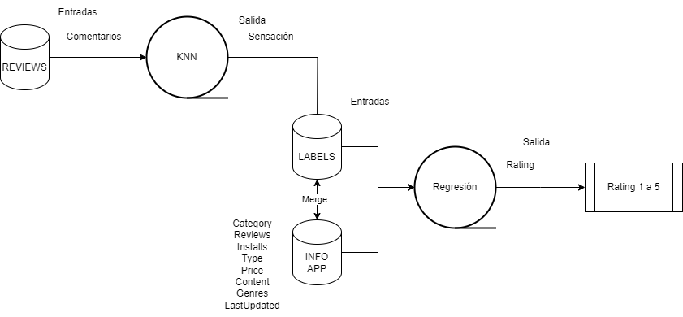

# Predicción de Rating de aplciaciones moviles a traves de comentarios

## Contexto

Conocer el rating que puede tener una app al realizar su lanzamiento es importante para tomar estrategias de marketing y de evolución de un producto nuevo.

Esto permite tambien mejorar la calidad de la aplicación teniendo en cuenta los comentarios del usuario final.
  

Dado lo anterior se propone proyectar cual será el rating de la app, procesando los comentarios y la información de la aplicación

## Información Datasets
### Reviews
Este dataset incluye los comentarios traducidos al inglés de todos los usuarios que tienen percepción Positiva, negativa y Neutra referente a la aplicación. dicho dataset tiene los siguientes datos:
|Campo|Descripción  |
|--|--|
| App | Nombre de la app |
| Translated_Review| Comentarios realizados por los usuarios|
| Sentiment|Positive/Negative/Neutral|
| Sentiment_Subjectivity|Sentiment subjectivity score|

### Info APPs
Este dataset incluye la información general de la aplicación que permite entender que tipo de aplicación es. dicho dataset tiene los siguientes datos:
|Campo|Descripción  |
|--|--|
| App | Nombre de la app |
| Category | Categoria que poertenece la app |
| Rating | Calificacion de 0 a 5 de las aplicaciones |
| Reviews | # de comentarios de sobre la app |
| Size | Tamaño de la app en MB |
| Installs | # de descargas de la app |
| Type | Paga o Gratis |
| Price | Precio en dolares |
| Content Rating | Tipo de publico al que va dirigido |
| Genres | multiple genero aparte de la Category |
| Current Ver | Versión App |
| Android Ver | Versión aNDROID objetivo |

## Funcionalidad

1. Tenemos un dataset de reviews el cual tiene comentarios en ingles sobre las apps.
2. Se realiza tratamiento de los datos e informaición
